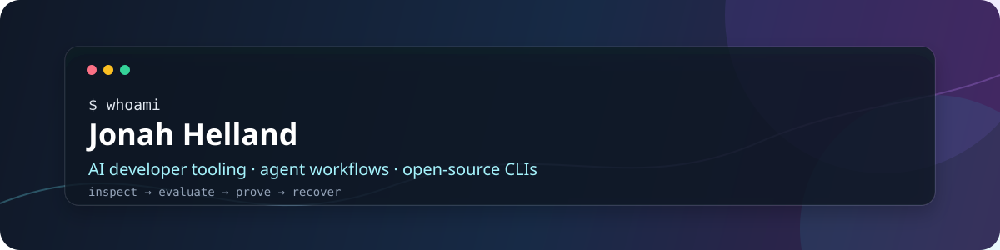

# Jonah Helland

I build tools that make **AI coding agents easier to inspect, evaluate, and recover**.

My work lives at the intersection of developer tools, local-first workflows, and agent reliability. The projects are small enough to install and understand, but practical enough to use in a real engineering loop.

<a href="https://x.com/jonahhelland">X / build notes</a> · <a href="https://github.com/jonah-ux">GitHub / source</a>

## Start here

| Project | Why it exists | Proof |
| --- | --- | --- |
| [Chatlens](https://github.com/jonah-ux/chatlens) | Search Codex, Claude Code, and Hermes sessions when the context behind a task is missing. | [v0.1.0 release](https://github.com/jonah-ux/chatlens/releases/tag/v0.1.0) · [CI](https://github.com/jonah-ux/chatlens/actions) |
| [Worktree Conservator](https://github.com/jonah-ux/worktree-conservator) | Retire Git worktrees with a reviewable plan, recoverable archives, and explicit identity checks. | [v0.1.0 release](https://github.com/jonah-ux/worktree-conservator/releases/tag/v0.1.0) · [CI](https://github.com/jonah-ux/worktree-conservator/actions) |
| [MCP Doctor](https://github.com/jonah-ux/mcp-doctor) | Lint MCP tool contracts before an agent sees an ambiguous or unsafe interface. | [README + feature head](https://github.com/jonah-ux/mcp-doctor/commit/3417a17) · [CI](https://github.com/jonah-ux/mcp-doctor/actions) |

## Now shipping

I’m building a small, connected toolkit rather than a collection of unrelated demos:

- **Recover the context:** [Chatlens](https://github.com/jonah-ux/chatlens) searches local agent sessions when the reasoning behind a task is missing.
- **Check the interface:** [MCP Doctor](https://github.com/jonah-ux/mcp-doctor) catches ambiguous tool contracts before they reach an agent.
- **Protect the workspace:** [Worktree Conservator](https://github.com/jonah-ux/worktree-conservator) makes Git worktree retirement reviewable and recoverable.

The smaller lab projects extend that same loop into evaluation, evidence, policy, tracing, and recovery.

## The agent tooling lab

These focused command-line tools explore the rest of the loop:

- [Agent Eval Kit](https://github.com/jonah-ux/agent-eval-kit) — reproducible command fixtures and scorecards.
- [Agent Proof](https://github.com/jonah-ux/agent-proof) — machine-readable evidence bundles for agent work.
- [Context Pack](https://github.com/jonah-ux/context-pack) — deterministic, bounded repository context.
- [Agent Policy](https://github.com/jonah-ux/agent-policy) — capability and permission decisions.
- [Agent Trace Lite](https://github.com/jonah-ux/agent-trace-lite) — redacted local traces from JSONL events.
- [Agent Resume](https://github.com/jonah-ux/agent-resume) — portable continuation records for unfinished tasks.
- [Agent Sandbox Run](https://github.com/jonah-ux/agent-sandbox-run) — explicit command limits with honest receipts.

## How I build

- **Agent-friendly by default:** noninteractive commands, stable JSON, meaningful exit codes.
- **Evidence before claims:** demos and fixtures show what a tool actually observed or enforced.
- **Small surfaces:** few dependencies, clear boundaries, easy local installation.
- **Honest limits:** security, isolation, provider behavior, and “user-visible result” claims stay explicit.

Most projects install directly from GitHub while their first releases mature:

```bash
pip install git+https://github.com/jonah-ux/mcp-doctor.git@main
```

The profile is the map; each repository contains its own README, demo, tests, security guidance, and release notes.
