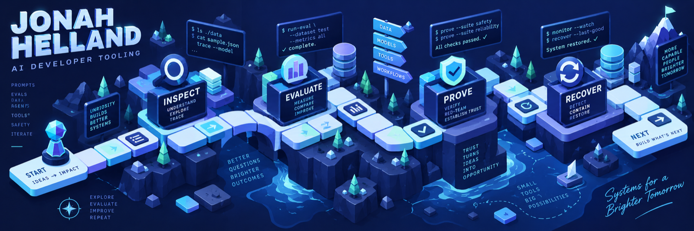
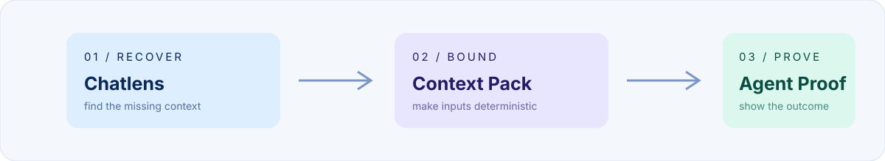
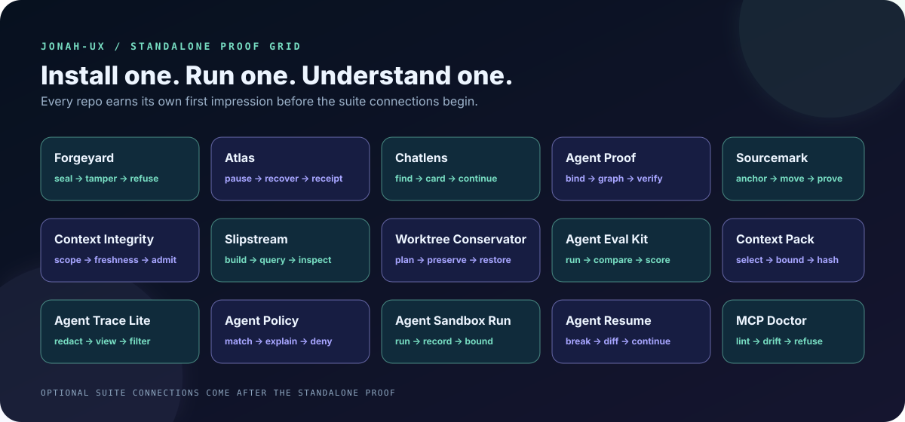

# Jonah Helland

I build **inspectable, recoverable tools for AI-assisted software engineering**.

Most of my work starts with a messy workflow and ends with a small system that makes the important parts easier to see: APIs, automation, local-first tools, and AI-agent infrastructure with clear failure modes and a way back. I use coding agents heavily, but the result still needs to be understandable, bounded, testable, and recoverable by a human.

[Build notes on X](https://x.com/jonahhelland) · [Source](https://github.com/jonah-ux) · [Deeper evidence and roadmap](docs/ENGINEERING-EVIDENCE.md)

## Flagship public suite

The newest portfolio slice is a three-tool evidence lifecycle: [ChatLens v0.4.0](https://github.com/jonah-ux/chatlens/releases/tag/v0.4.0) exports a redacted local trace, [Atlas v0.2.0](https://github.com/jonah-ux/atlas-agent-runtime/releases/tag/v0.2.0) records a durable approval-gated task, and [Forgeyard v0.4.0](https://github.com/jonah-ux/forgeyard/releases/tag/v0.4.0) composes both into a reviewable record through `ai-work-evidence/v1`. [Read the reviewer map](docs/PORTFOLIO-SUITE-V2.md).

The larger [Agent Systems Lab architecture](docs/AGENT-SYSTEMS-LAB-ARCHITECTURE.md) connects
context admission, policy, bounded execution, proof, continuation, retrieval, and reviewable
delivery through explicit owners rather than a monolithic runtime.

## Choose your own 90-second proof

Every project below is a standalone product. Install one, run its own disposable demo, inspect its
machine-readable result, and decide whether it is useful before you ever look at another repository.
The broader suite is an optional map for people who want to connect the outputs later.

| Project | Start here | The moment to watch |
| --- | --- | --- |
| [Forgeyard](https://github.com/jonah-ux/forgeyard) | [one-minute quickstart](https://github.com/jonah-ux/forgeyard/blob/main/docs/quickstart.md) | A review record seals, then refuses a tampered byte boundary. |
| [Atlas Agent Runtime](https://github.com/jonah-ux/atlas-agent-runtime) | [standalone lifecycle](https://github.com/jonah-ux/atlas-agent-runtime/blob/main/docs/quickstart.md) | A task pauses for approval, recovers from its event log, and emits a receipt. |
| [Chatlens](https://github.com/jonah-ux/chatlens) | [quick start](https://github.com/jonah-ux/chatlens#quick-start) | A lost session becomes a searchable work card without a hosted service. |
| [Agent Proof](https://github.com/jonah-ux/agent-proof) | [synthetic demo](https://github.com/jonah-ux/agent-proof#quick-start) | A proof bundle binds artifacts, graph edges, and tamper refusal together. |
| [Context Integrity Lab](https://github.com/jonah-ux/context-integrity-lab) | [reviewer walkthrough](https://github.com/jonah-ux/context-integrity-lab/blob/main/DEMO.md) | Supported, stale, and out-of-scope context split into visible admission states. |
| [Sourcemark](https://github.com/jonah-ux/sourcemark) | [30-second demo](https://github.com/jonah-ux/sourcemark#install) | A citation keeps its anchor or gets called out when its source moves. |
| [Slipstream](https://github.com/jonah-ux/slipstream) | [local vector demo](https://github.com/jonah-ux/slipstream#install-and-run) | A nearest-neighbor query runs locally and leaves a manifest you can verify. |
| [Worktree Conservator](https://github.com/jonah-ux/worktree-conservator) | [preservation demo](https://github.com/jonah-ux/worktree-conservator#quick-start) | A cleanup plan can be refused, archived, verified, and restored without guessing. |
| [Agent Eval Kit](https://github.com/jonah-ux/agent-eval-kit) | [scorecard demo](https://github.com/jonah-ux/agent-eval-kit#quick-start) | Repeated trials become a bounded comparison instead of a vibes-based ranking. |
| [Context Pack](https://github.com/jonah-ux/context-pack) | [deterministic pack demo](https://github.com/jonah-ux/context-pack#quick-start) | A byte budget and digest make the exact context set inspectable. |
| [Agent Trace Lite](https://github.com/jonah-ux/agent-trace-lite) | [redacted trace demo](https://github.com/jonah-ux/agent-trace-lite#quick-start) | A trace becomes a readable artifact while sensitive fields stay redacted. |
| [Agent Policy](https://github.com/jonah-ux/agent-policy) | [policy quickstart](https://github.com/jonah-ux/agent-policy#quick-start) | A decision explains which rule matched and why the default is deny. |
| [Agent Sandbox Run](https://github.com/jonah-ux/agent-sandbox-run) | [capability demo](https://github.com/jonah-ux/agent-sandbox-run#quick-start) | The receipt says exactly what was enforced and what remained a fallback. |
| [Agent Resume](https://github.com/jonah-ux/agent-resume) | [continuation demo](https://github.com/jonah-ux/agent-resume#quick-start) | A broken handoff turns into a validated next step with an explicit diff. |
| [MCP Doctor](https://github.com/jonah-ux/mcp-doctor) | [contract check](https://github.com/jonah-ux/mcp-doctor#quick-start) | A missing description or timeout fails closed with a stable diagnostic code. |

For the optional multi-repo story, see the [portfolio suite map](docs/PORTFOLIO-SUITE-V2.md). It
connects outputs after each repository already works on its own; it is never an installation
prerequisite.

## The engineering loop

These tools explore one practical question: **can agent work be understood, bounded, proved, and continued?**

- **Recover context:** Chatlens turns local session stores into searchable, bounded work cards.
- **Check the interface:** MCP Doctor catches ambiguous tool contracts before an agent sees them.
- **Bound and run:** Context Pack, Agent Policy, and Agent Sandbox Run make inputs, permissions, and execution limits explicit.
- **Record and continue:** Agent Proof, Agent Trace Lite, and Agent Resume preserve evidence and continuation state.

Each repository contains its own install path, tests, demos, release notes, and security boundary. Start with the disposable demo before connecting a tool to a real workflow. The repositories describe what a check proves and what it cannot prove; a valid digest is not a claim of deployment, adoption, or a user-visible result.

For a runnable cross-project example, see the [public integration walkthrough](docs/INTEGRATION-WALKTHROUGH.md): Context Integrity Lab admits scoped, fresh context, Agent Proof normalizes and source-binds the result, and Forgeyard records the bounded review decision. The same walkthrough covers MCP Doctor contract checks, sandbox receipt scoring, loss-aware evidence envelopes, and Chatlens-to-Agent-Trace export while keeping source, release, and outcome claims separate.

## Public provenance

The profile is a current public engineering portfolio, not an attempt to manufacture elapsed time or adoption. Most original projects were built and released recently. I am keeping that history intact and using the next work to show depth: adversarial tests, clean installed-consumer checks, clearer architecture, and maintenance driven by real use.

[Engineering evidence](docs/ENGINEERING-EVIDENCE.md) · [Work samples](docs/WORK-SAMPLES.md) · [Ship log](docs/SHIPLOG.md)
