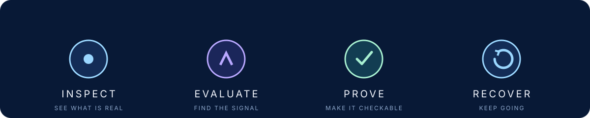
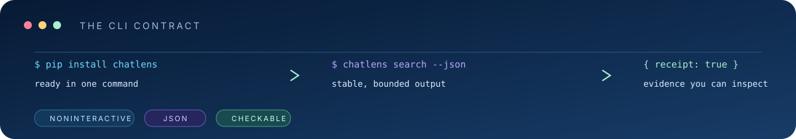

# Jonah Helland

I build tools that make **AI coding agents easier to inspect, evaluate, and recover**.

My work lives at the intersection of developer tools, local-first workflows, and agent reliability. The projects are small enough to install and understand, but practical enough to use in a real engineering loop. See the [developer presence plan](docs/DEVELOPER-PRESENCE.md) for the public surfaces I’m building around the same evidence.

<a href="https://x.com/jonahhelland">X / build notes</a> · <a href="docs/SHIPLOG.md">Ship log / evidence</a> · <a href="https://github.com/jonah-ux">GitHub / source</a>

## For hiring teams

I’m interested in work where reliable software has to cross the boundary between **APIs, databases, integrations, automation, and AI agents**. I like owning the full path from a small, understandable interface through tests, release evidence, and an outcome another person can verify. See the [one-minute work samples](docs/WORK-SAMPLES.md) and the [engineering evidence map](docs/ENGINEERING-EVIDENCE.md) for the shortest hiring-team walkthrough.

## Start here

| Project | Why it exists | Proof |
| --- | --- | --- |
| [Slipstream](https://github.com/jonah-ux/slipstream) | Build a local SQLite + sqlite-vec index for fast, inspectable agent retrieval. | [v0.1.0 prerelease](https://github.com/jonah-ux/slipstream/releases/tag/v0.1.0) · [CI](https://github.com/jonah-ux/slipstream/actions) |
| [Chatlens](https://github.com/jonah-ux/chatlens) | Search Codex, Claude Code, and Hermes sessions when the context behind a task is missing. | [v0.1.0 release](https://github.com/jonah-ux/chatlens/releases/tag/v0.1.0) · [CI](https://github.com/jonah-ux/chatlens/actions) |
| [Worktree Conservator](https://github.com/jonah-ux/worktree-conservator) | Retire Git worktrees with a reviewable plan, recoverable archives, and independent readback. | [v0.2.0 prerelease](https://github.com/jonah-ux/worktree-conservator/releases/tag/v0.2.0) · [CI](https://github.com/jonah-ux/worktree-conservator/actions) |
| [MCP Doctor](https://github.com/jonah-ux/mcp-doctor) | Lint MCP tool contracts before an agent sees an ambiguous or unsafe interface. | [v0.2.4 prerelease](https://github.com/jonah-ux/mcp-doctor/releases/tag/v0.2.4) · [CI](https://github.com/jonah-ux/mcp-doctor/actions) |

### Evidence status

The release signal is intentionally explicit so a visitor can tell what is
consumer-installable today and what is still being shaped. The full
[portfolio evidence matrix](docs/PORTFOLIO-EVIDENCE.md) records the clean
public-main install and demo run for every supporting tool.

| Signal | Projects | What the link proves |
| --- | --- | --- |
| Public prerelease + fresh consumer install | [Slipstream](https://github.com/jonah-ux/slipstream), [Chatlens](https://github.com/jonah-ux/chatlens), [Worktree Conservator](https://github.com/jonah-ux/worktree-conservator) | Versioned tag, downloadable assets, checksums, and a clean install path |
| Public prerelease + hosted consumer checks | [MCP Doctor](https://github.com/jonah-ux/mcp-doctor), [Agent Eval Kit](https://github.com/jonah-ux/agent-eval-kit), [Agent Proof](https://github.com/jonah-ux/agent-proof), [Context Pack](https://github.com/jonah-ux/context-pack), [Agent Policy](https://github.com/jonah-ux/agent-policy), [Agent Trace Lite](https://github.com/jonah-ux/agent-trace-lite), [Agent Resume](https://github.com/jonah-ux/agent-resume), [Agent Sandbox Run](https://github.com/jonah-ux/agent-sandbox-run) | Public prerelease assets, semantic tags, hosted release checks, and install/demo verification are visible; Agent Proof’s current `main` also carries a newer unreleased bundle-verifier candidate |

The profile links directly to the public release and verification trail so a visitor can inspect the install path instead of relying on activity signals. The profile links to evidence, not activity theater.

## The loop



The projects are small on purpose, but they fit together around one engineering question: **can an agent’s work be understood, bounded, and continued?**

| Moment | Tool | Observable result |
| --- | --- | --- |
| Recover context | [Chatlens](https://github.com/jonah-ux/chatlens) | Searchable local sessions and bounded work cards |
| Bound the input | [Context Pack](https://github.com/jonah-ux/context-pack) | Deterministic files, byte budget, and SHA-256 digest |
| Decide before acting | [Agent Policy](https://github.com/jonah-ux/agent-policy) | Allow or deny decision with a reason |
| Run and inspect | [Agent Sandbox Run](https://github.com/jonah-ux/agent-sandbox-run) | Receipt naming the backend and enforcement state |
| Record the outcome | [Agent Proof](https://github.com/jonah-ux/agent-proof) | Hashable evidence envelope with explicit unknowns |
| Continue later | [Agent Resume](https://github.com/jonah-ux/agent-resume) | Identity-bound continuation record |

## Now shipping

I’m building a small, connected toolkit rather than a collection of unrelated demos. See the [public roadmap](docs/ROADMAP.md) for the next evidence-backed milestones:

- **Recover the context:** [Chatlens](https://github.com/jonah-ux/chatlens) searches local agent sessions when the reasoning behind a task is missing.
- **Check the interface:** [MCP Doctor](https://github.com/jonah-ux/mcp-doctor) catches ambiguous tool contracts before they reach an agent.
- **Protect the workspace:** [Worktree Conservator](https://github.com/jonah-ux/worktree-conservator) makes Git worktree retirement reviewable, recoverable, and independently verifiable.

The smaller lab projects extend that same loop into evaluation, evidence, policy, tracing, and recovery.

The next public candidates are tracked in the [open-source pipeline](docs/OPEN-SOURCE-PIPELINE.md). Slipstream is now the first extracted candidate with a public prerelease; the sanitized BreakTrace evidence core is next, while private system and customer boundaries stay explicit.

## The agent tooling lab


These focused command-line tools explore the rest of the loop:

- [Agent Eval Kit](https://github.com/jonah-ux/agent-eval-kit) — reproducible command fixtures and scorecards.
- [Agent Proof](https://github.com/jonah-ux/agent-proof) — machine-readable evidence bundles for agent work.
- [Context Pack](https://github.com/jonah-ux/context-pack) — deterministic, bounded repository context.
- [Agent Policy](https://github.com/jonah-ux/agent-policy) — capability and permission decisions.
- [Agent Trace Lite](https://github.com/jonah-ux/agent-trace-lite) — redacted local traces from JSONL events.
- [Agent Resume](https://github.com/jonah-ux/agent-resume) — portable continuation records for unfinished tasks.
- [Agent Sandbox Run](https://github.com/jonah-ux/agent-sandbox-run) — explicit command limits with honest receipts.

## How I build



- **Agent-friendly by default:** noninteractive commands, stable JSON, meaningful exit codes.
- **Evidence before claims:** demos and fixtures show what a tool actually observed or enforced.
- **Small surfaces:** few dependencies, clear boundaries, easy local installation.
- **Honest limits:** security, isolation, provider behavior, and “user-visible result” claims stay explicit.

Start with the released flagship or run any project’s disposable demo before connecting it to a real agent loop:

```bash
npm install --global https://github.com/jonah-ux/slipstream/releases/download/v0.1.0/slipstream-local-index-0.1.0.tgz
slipstream self-test
```

Every supporting tool repository has a visible demo, tests, CI, security guidance, and release notes. The profile repository and upstream forks are shown for provenance; the supporting repositories contain the authored tool evidence.
