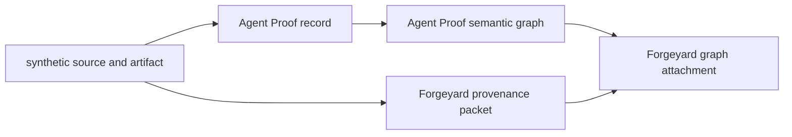

# Follow a failed evidence handoff

This walkthrough follows one small public fixture through Agent Proof's graph verifier and
Forgeyard's packet attachment. It shows where a changed byte, a resealed orphan edge, a missing
input, or a stale artifact is refused. The two tools retain their native responsibilities:



Agent Proof checks graph structure and its relationship to the source record. Forgeyard checks
the packet's live source bytes and the attachment's relationship to the packet and graph. An
attachment's valid digest does not replace Agent Proof's semantic verification.

Use Python 3.11 or later, Git, and a Bash-compatible shell. Start from this profile's checkout:

```console
git clone https://github.com/jonah-ux/jonah-ux.git lab-review
cd lab-review
```

The runnable `bash` blocks below share one shell. Hosted CI runs those same blocks. Cloning the
public source is the only network step; the fixture and verifiers run locally without a provider,
database, transcript store, credentials, or access to an employer system.

## 1. Resolve the frozen owners

Read source pins from the existing review lock, validate the packet, then check out those exact
commits. This recipe introduces no separate owner registry and does not silently substitute main.

```bash
set -euo pipefail
profile_root="$PWD"
python3 scripts/validate_review_packet.py --json
read -r proof_head forgeyard_head < <(python3 - <<'PY'
import json
from pathlib import Path
lock = json.loads(Path("docs/AGENT-SYSTEMS-LAB-REVIEW-LOCK.json").read_text())
owners = {item["repository"]: item["source_head"] for item in lock["owners"]}
print(owners["jonah-ux/agent-proof"], owners["jonah-ux/forgeyard"])
PY
)
work_dir="$(mktemp -d)"
git clone --quiet https://github.com/jonah-ux/agent-proof.git "$work_dir/agent-proof"
git -C "$work_dir/agent-proof" checkout --quiet --detach "$proof_head"
git clone --quiet https://github.com/jonah-ux/forgeyard.git "$work_dir/forgeyard"
git -C "$work_dir/forgeyard" checkout --quiet --detach "$forgeyard_head"
test "$(git -C "$work_dir/agent-proof" rev-parse HEAD)" = "$proof_head"
test "$(git -C "$work_dir/forgeyard" rev-parse HEAD)" = "$forgeyard_head"
export PYTHONPATH="$work_dir/agent-proof/src:$work_dir/forgeyard/src"
cd "$work_dir"
python3 -S -m agent_proof.cli --version
python3 -S -m forgeyard.cli --version
mkdir artifacts reports
```

`-S` excludes installed site packages. These commands exercise the pinned public source; they
do not add a package-install or published-release claim. The review lock records those boundaries
separately.

## 2. Build a bounded fixture and verify the graph

The source shape below is the legacy policy fixture already used by Agent Proof's graph tests.
It does not run Agent Policy. The result fields are authored fixture inputs: verifying their
integrity cannot independently prove that a described operation happened.

```bash
printf 'Synthetic graph artifact.\n' > artifacts/probe.txt
cp artifacts/probe.txt artifacts/probe-original.txt
cat > artifacts/policy.json <<'JSON'
{"schema":"agent-policy/v1","decision":"allow"}
JSON
cat > artifacts/spec.json <<'JSON'
{
  "run_id": "failure-walkthrough",
  "actor": "synthetic-fixture",
  "recorded_at": "2026-10-03T00:00:00Z",
  "repository": {
    "url": "https://example.invalid/fixture",
    "branch": "main",
    "commit": "0123456789abcdef0123456789abcdef01234567"
  },
  "operation": {"argv": ["synthetic-fixture"], "cwd": "."},
  "result": {
    "exit_code": 0,
    "duration_ms": 0,
    "stdout": "synthetic fixture",
    "stderr": "",
    "observed": true,
    "partial": false,
    "unknowns": []
  },
  "sources": ["policy.json"],
  "artifacts": [{"path": "probe.txt", "label": "synthetic artifact"}],
  "notes": ["Authored protocol fixture; no production execution claim."]
}
JSON
python3 -S -m agent_proof.cli record artifacts/spec.json \
  --artifact-root artifacts --out artifacts/proof.json > reports/record.json
python3 -S -m agent_proof.cli graph artifacts/proof.json \
  --artifact-root artifacts --require-observed --require-artifacts \
  --out artifacts/graph.json > reports/graph-build.json
python3 -S -m agent_proof.cli verify-graph artifacts/graph.json \
  --input artifacts/proof.json --artifact-root artifacts \
  --require-input --require-observed --require-artifacts > reports/graph-bound.json
python3 - <<'PY'
import json
from pathlib import Path
report = json.loads(Path("reports/graph-bound.json").read_text())
if report["ok"] is not True or report["bound_input"] is not True:
    raise SystemExit("the baseline graph did not bind to its input")
print("baseline graph: verified against the live fixture")
PY
```

Keep the graph's `graph_sha256`, input digest, node/edge counts, source state, and artifact state
with this report. The verification covers the named fixture and supplied flags.

## 3. Bind the graph to a Forgeyard packet

Create a review record about this fixture, bind its receipt to `probe.txt`, then attach the graph.
The attachment carries a bounded summary and digests, not a second copy of the graph payload.

```bash
python3 -S -m forgeyard.cli create \
  --task-id failure-walkthrough --repository synthetic-fixture \
  --request 'review the synthetic graph fixture' \
  --evidence 'fixture=pass:bound graph verification completed' \
  --output artifacts/review.json > reports/review-create.json
python3 -S -m forgeyard.cli receipt artifacts/review.json \
  --name fixture --path probe.txt \
  --output artifacts/fixture.receipt.json > reports/receipt.json
python3 -S -m forgeyard.cli packet artifacts/review.json \
  --receipt artifacts/fixture.receipt.json --source-root artifacts \
  --revision fixture-r1 --path probe.txt \
  --output artifacts/packet.json > reports/packet-build.json
python3 -S -m forgeyard.cli verify-packet artifacts/packet.json \
  --source-root artifacts > reports/packet-verify.json
python3 -S -m forgeyard.cli graph-attach artifacts/packet.json artifacts/graph.json \
  --output artifacts/attachment.json > reports/attachment-build.json
python3 -S -m forgeyard.cli verify-graph-attachment artifacts/attachment.json \
  --packet artifacts/packet.json --graph artifacts/graph.json \
  > reports/attachment-bound.json
python3 - <<'PY'
import json
from pathlib import Path
for name in ("packet-verify", "attachment-bound"):
    report = json.loads(Path(f"reports/{name}.json").read_text())
    if report["ok"] is not True:
        raise SystemExit(f"{name} did not verify the baseline")
attachment = json.loads(Path("artifacts/attachment.json").read_text())
if "nodes" in attachment["graph"] or "edges" in attachment["graph"]:
    raise SystemExit("the attachment copied graph payloads")
print("baseline packet and graph attachment: verified")
PY
```

The review record's pass entry names a check this recipe just ran. It is not a claim of deployment,
outside adoption, command authorization, or production success.

## 4. Change the graph without changing its digest

Save each refusal's JSON and check the native exit status. The helper below does not consider an
exception or any nonzero exit a successful refusal: these verification commands must return
their expected exit `1`, an `ok=false` report, and the expected reason from the pinned owner.

```bash
expect_refusal() {
  local report_path="$1"
  local expected_reason="$2"
  shift 2
  local exit_status=0
  "$@" > "$report_path" || exit_status=$?
  test "$exit_status" -eq 1
  python3 - "$report_path" "$expected_reason" <<'PY'
import json
import sys
from pathlib import Path
report = json.loads(Path(sys.argv[1]).read_text())
if report.get("ok") is not False:
    raise SystemExit("expected a structured native refusal")
if not any(sys.argv[2] in error for error in report.get("errors", [])):
    raise SystemExit("the verifier refused for a different reason")
print(f"refused: {Path(sys.argv[1]).name}")
PY
}
python3 - <<'PY'
import json
from pathlib import Path
graph = json.loads(Path("artifacts/graph.json").read_text())
graph["run_id"] = "changed-fixture"
Path("artifacts/graph-changed.json").write_text(json.dumps(graph))
PY
expect_refusal reports/graph-changed.json 'canonical graph content' \
  python3 -S -m agent_proof.cli verify-graph artifacts/graph-changed.json \
  --input artifacts/proof.json --artifact-root artifacts --require-input
expect_refusal reports/attachment-changed-graph.json 'graph digest mismatch' \
  python3 -S -m forgeyard.cli verify-graph-attachment artifacts/attachment.json \
  --packet artifacts/packet.json --graph artifacts/graph-changed.json
```

Agent Proof should report that the graph's canonical digest no longer matches. Forgeyard should
refuse the graph binding. Preserve both reports; each owner rejected a different boundary.

## 5. Reseal an orphan edge

A new digest alone cannot make an invalid relationship meaningful. Use Agent Proof's own digest
routine to keep canonical hashing/order valid while adding an edge to a node that does not exist.

```bash
python3 - <<'PY'
import json
from pathlib import Path
from agent_proof.ledger import digest_json
graph = json.loads(Path("artifacts/graph.json").read_text())
record = next(node["id"] for node in graph["nodes"] if node["id"].startswith("record:"))
graph["edges"].append({
    "from": record, "to": "blob:" + "0" * 64,
    "kind": "produces", "role": "artifact", "path": "probe.txt"
})
graph["edges"].sort(key=digest_json)
graph["edge_count"] = len(graph["edges"])
graph["graph_sha256"] = digest_json({
    key: value for key, value in graph.items() if key != "graph_sha256"
})
Path("artifacts/graph-orphan.json").write_text(json.dumps(graph))
PY
expect_refusal reports/graph-orphan.json 'unknown to node' \
  python3 -S -m agent_proof.cli verify-graph artifacts/graph-orphan.json \
  --input artifacts/proof.json --artifact-root artifacts --require-input
```

The report should identify an unknown endpoint and a difference from the graph derived from the
bound source. Forgeyard's sidecar is not the semantic graph authority: do not admit a new graph
because a freshly created attachment happens to have consistent hashes.

## 6. Remove the bound input, then change the live artifact

First inspect the explicit unbound state, then request the input gate. Finally change only the
artifact bytes, keeping every saved proof, graph, packet, and attachment intact.

```bash
python3 -S -m agent_proof.cli verify-graph artifacts/graph.json \
  > reports/graph-unbound.json
python3 - <<'PY'
import json
from pathlib import Path
report = json.loads(Path("reports/graph-unbound.json").read_text())
if report["ok"] is not True or report["bound_input"] is not False:
    raise SystemExit("expected an intact but unbound graph")
if "input_not_bound" not in report["unknowns"]:
    raise SystemExit("the missing input was not disclosed")
print("unbound graph: integrity checked, source not verified")
PY
expect_refusal reports/graph-required-input.json 'source input is required' \
  python3 -S -m agent_proof.cli verify-graph artifacts/graph.json --require-input
expect_refusal reports/attachment-missing-inputs.json 'graph input is required' \
  python3 -S -m forgeyard.cli verify-graph-attachment artifacts/attachment.json
printf 'Changed artifact bytes.\n' >> artifacts/probe.txt
expect_refusal reports/graph-stale-artifact.json 'digest or size mismatch' \
  python3 -S -m agent_proof.cli verify-graph artifacts/graph.json \
  --input artifacts/proof.json --artifact-root artifacts --require-input --require-artifacts
expect_refusal reports/packet-stale-artifact.json 'source bytes changed' \
  python3 -S -m forgeyard.cli verify-packet artifacts/packet.json --source-root artifacts
```

The unbound graph check is allowed to pass its integrity check while exposing `input_not_bound`.
Adding `--require-input` makes that missing evidence a refusal. The changed artifact should fail
both the source-bound proof/graph path and Forgeyard's live source check.

## Read the failure without upgrading the claim

| Case | Owner / gate | Expected result | Meaning |
| --- | --- | --- | --- |
| Baseline graph | Agent Proof, input + observed + artifact gates | exit `0`, bound input | The fixture graph matches the supplied record and live bytes. |
| Baseline packet/attachment | Forgeyard, live source + both attachment inputs | exit `0` | The packet source and graph/packet binding agree. |
| Changed graph | Both owners | exit `1`, `ok=false` | Original hashes/bindings no longer match. |
| Resealed orphan | Agent Proof semantic verifier | exit `1`, `ok=false` | Canonical hashing does not establish valid node relationships. |
| Unbound graph | Agent Proof without the input gate | exit `0`, `input_not_bound` | Integrity is checked; source provenance remains unbound. |
| Required missing input | Native input gates | exit `1`, `ok=false` | Missing evidence cannot be silently substituted. |
| Changed live artifact | Both source-bound owners | exit `1`, `ok=false` | Saved evidence no longer describes the supplied bytes. |

The generated files remain in `$work_dir` for inspection. Keep the source heads, exact command,
original and changed input digests, native JSON reports, and exit status when reporting a defect.
Hosted CI preserves the original fixture bytes, mutated fixtures, source heads, and verification
reports as `failure-walkthrough-OS-PYTHON` artifacts. Generic runner-root paths are redacted in
report copies; fixture files retain their exact bytes so source-digest verification can be replayed.
Return to `$profile_root` when finished. Remove only this disposable directory after preserving
the evidence you need; no real worktree or transcript store is part of this recipe.

Read the owning [Agent Proof graph implementation](https://github.com/jonah-ux/agent-proof/blob/main/src/agent_proof/graph.py),
[Forgeyard attachment contract](https://github.com/jonah-ux/forgeyard/blob/main/docs/contracts/forgeyard-provenance-graph-v1.md),
and [threat model](AGENT-SYSTEMS-LAB-THREAT-MODEL.md) for the precise boundaries. A verifier checks
its supplied claims and bytes; it does not authenticate the person who authored those claims or
establish production outcomes. Outside review and adoption remain separate observations.
